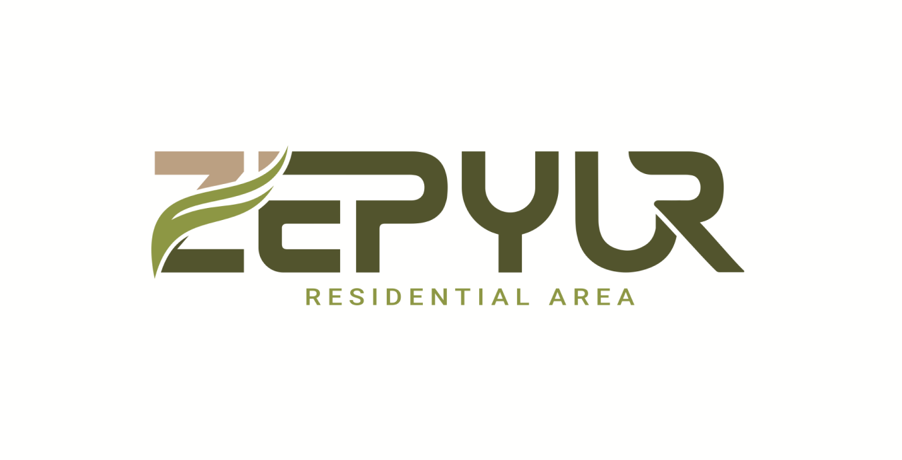

# 🌬️ Zepyur

**Zepyur** is a modern multilingual website built with **Next.js v15**, **TypeScript**, and **i18next**.  
The project showcases best practices in UI development, internationalization, and component architecture.



---

## 🚀 Technologies

- [Next.js 15](https://nextjs.org/) — React framework with SSR and SSG support  
- [TypeScript](https://www.typescriptlang.org/) — Typed JavaScript  
- [i18next](https://www.i18next.com/) — Internationalization and localization  
- [Tailwind CSS](https://tailwindcss.com/) — Utility-first CSS framework  
- [Geist](https://vercel.com/fonts/geist) — Modern font by Vercel  

---

## 📦 Installation and Running

1. Clone the repository:

   ```bash
   git clone https://github.com/adlermore/zepyur.git
   cd zepyur
   ```

2. Install dependencies:

   ```bash
   npm install
   # or
   yarn install
   ```

3. Start the development server:

   ```bash
   npm run dev
   # or
   yarn dev
   ```

4. Open [http://localhost:3000](http://localhost:3000) in your browser.

---

## 🌍 Internationalization

This project supports multiple languages using **i18next**.  
Translation files are located in the `messages/` directory.  
You can easily add new languages or edit existing translations.

---

## 🧱 Project Structure

```
├── app/                # Pages and routes
├── components/         # Reusable components
├── i18n/               # i18next configuration
├── messages/           # Translation files
├── public/             # Static assets
├── styles/             # Global styles
├── next.config.ts      # Next.js configuration
├── tsconfig.json       # TypeScript configuration
└── ...
```

---

## 🛠️ Scripts

| Command         | Description                        |
|-----------------|------------------------------------|
| `npm run dev`   | Start the development server       |
| `npm run build` | Build the project                  |
| `npm run start` | Start the production server        |
| `npm run lint`  | Run ESLint to check code quality   |

---

## 🤝 Contribution

Contributions are welcome!  
If you have suggestions, bug reports, or want to improve the project, feel free to open an [Issue](https://github.com/adlermore/zepyur/issues) or submit a Pull Request.

---

## 📄 License

This project is licensed under the [MIT License](LICENSE).
